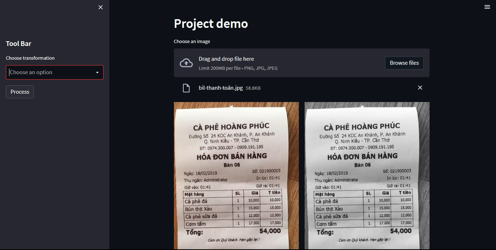
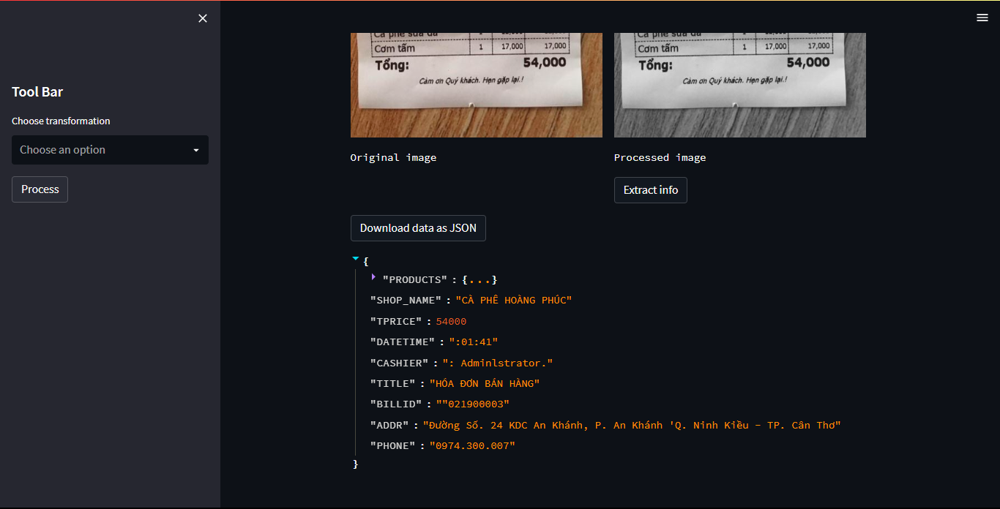
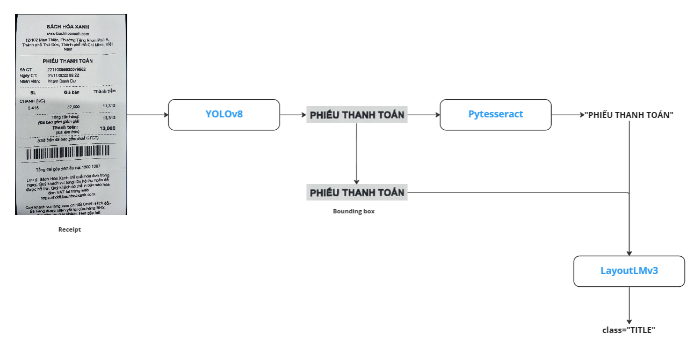
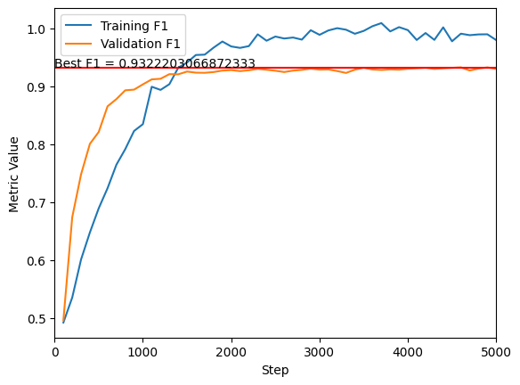

# Receipt Information Extraction (RIE)

## Intro

- **Receipt information extraction** is the process of automatically identifying and extracting relevant information from receipts, such as the date, merchant name, total amount, and individual item prices.
- **Receipt information extraction** has numerous practical applications, such as in accounting, expense tracking, and financial analysis. By automating the extraction of receipt information, businesses can save time and reduce errors associated with manual data entry.
- In this project, we focus on working with Vietnamese-language’s receipt.

<p align="center">
  
</p>

<p align="center">
  
</p>

## Contributors

- Duong T. Thanh ([@duongttr](https://github.com/duongttr))
- Nguyen N. Doan Hieu ([@ndhieunguyen](https://github.com/ndhieunguyen))
- Khoi N. The ([@nguyenthekhoig7](https://github.com/nguyenthekhoig7))
- Hau T. Hoang ([@hautran7201](https://github.com/hautran7201))
- Kiet T. Tuan

## Project's flow

<p align="center">
  
</p>

The image will be processed through [**YOLOv8**](https://github.com/ultralytics/ultralytics) for detecting bounding boxes of texts. After cropping out, the image will be pushed to OCR engine ([**Pytesseract**](https://github.com/tesseract-ocr/tesseract) in this case) to read the content. Images and texts are combined to push to [**LayoutLMv3**](https://huggingface.co/docs/transformers/model_doc/layoutlmv3) for classifying classes.

## Evaluation

<p align="center">
  
</p>

Best F1-Score on evaluation dataset = `0.93222`

## Presentation

You can take a look at our [presentation slide](https://docs.google.com/presentation/d/1WTjoyddL2E7f9409SqT-ADI-HZIoFe8X3fBlDz-WfPk/edit?usp=sharing) for more details

## Dataset

[GG Drive](https://drive.google.com/file/d/1_2tBXQSF1-lk4BVxs1WIR1ymWGkfMzVZ/view?usp=share_link)

## Pretrained models

Check **Releases** section for downloading latest models.

## How-to-use

### Fine-tuning model

Download dataset and place it to folder `dataset`, follow this structure:

- `images`: Folder contains receipt images
- `train.json`: Train annotation
- `val.json`: Val annotation

Then run this command:

```python
python train.py --output_dir <output_dir> \
                 --max_steps 15000 \
                 --batch_size 4
```

Check the source code for more parameters.

### Run the program

1. Clone the repo

```
git clone https://github.com/duongttr/vireceipt-information-extraction.git
cd vireceipt-information-extraction
```

2. Install dependency

```
conda env create -f environment.yml
```

or

```
pip install -r requirements
```

3. Run localhost

```
python -m streamlit run VIE_run.py
```

## References

- Tesseract documentation. Tesseract OCR. (n.d.). Retrieved March 31, 2023, from https://tesseract-ocr.github.io/
- A new state-of-the-art computer vision model. YOLOv8. (n.d.). Retrieved March 31, 2023, from https://yolov8.com/
  Tesseract documentation. Tesseract OCR. (n.d.). Retrieved March 31, 2023, from https://tesseract-ocr.github.io/
- Huang, Y., Lv, T., Cui, L., Lu, Y., & Wei, F. (2022). LayoutLMv3: Pre-training for Document AI with Unified Text and Image Masking. ArXiv. /abs/2204.08387
